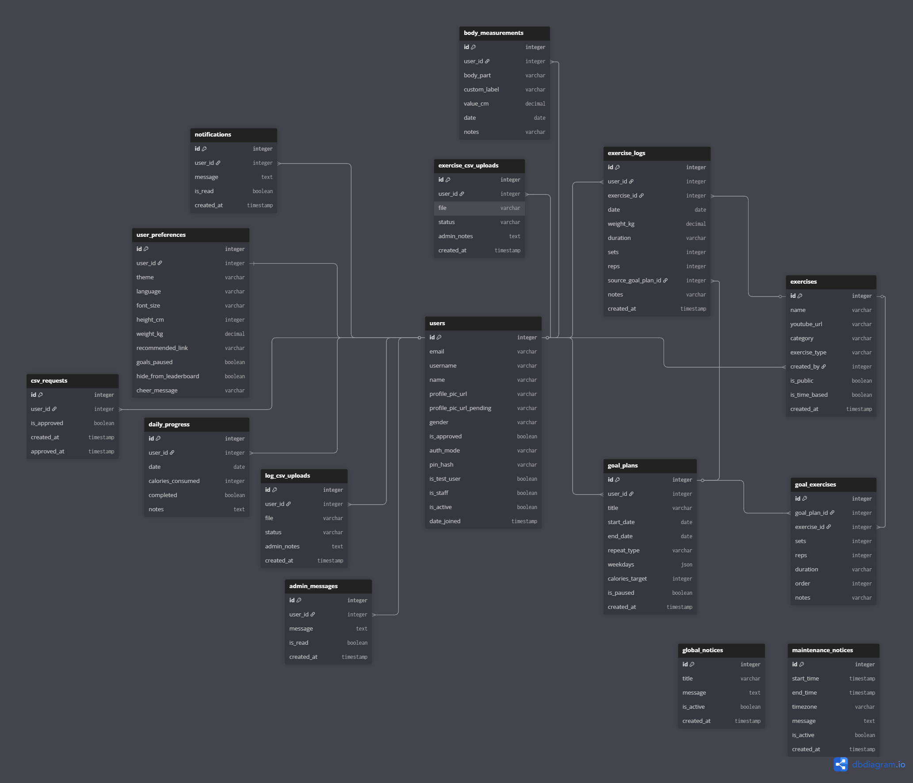

# GymJourney: An Integrated Fitness Tracking System

GymJourney is a full-stack application designed for longitudinal fitness data management and community-driven performance benchmarking. It provides a technical framework for goal-setting, anthropometric tracking, and relative strength analysis.

## Core Architecture

- **Data Persistence**: Relational schema manages high-fidelity exercise logs, goal plans, and anatomical measurements.
- **Biometric Visualization**: Integrated 2D body mapping for localized measurement tracking over time.
- **Performance Metrics**: Dynamic calculation of daily average intensity and relative ranking algorithms for the weekly leaderboard.
- **Interface Design**: Mobile-responsive React frontend utilizing a custom CSS-in-JS design system with glassmorphism aesthetics.

## Schema Overview

The database architecture leverages normalized relational tables to maintain integrity across users, preferences, and fitness metrics. 

## Implementation Details

### Backend (Django)
1. Environment initialization: `python -m venv .venv`
2. Dependency installation: `pip install -r requirements.txt`
3. Schema migration: `python manage.py migrate`
4. Server execution: `python manage.py runserver`

### Frontend (React/Vite)
1. Dependency management: `npm install`
2. ExecutionPolicy Unrestricted -Scope CurrentUser (for powershell permisions)
3. Development server: `npm run dev`
4. Access point: `http://localhost:5173`

## Technical Stack
- **Backend**: Django, Django REST Framework
- **Frontend**: React 18, Vite, Recharts, Lucide
- **Database**: PostgreSQL / SQLite
- **Styling**: Vanilla CSS (Custom Design System)
